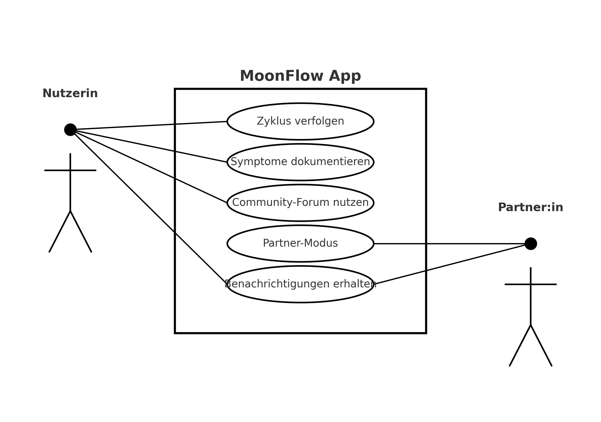
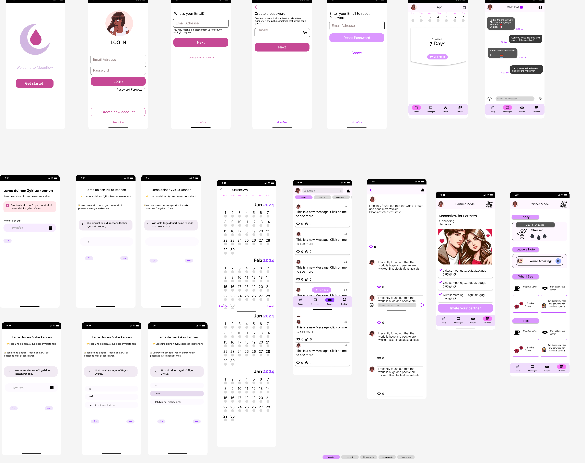
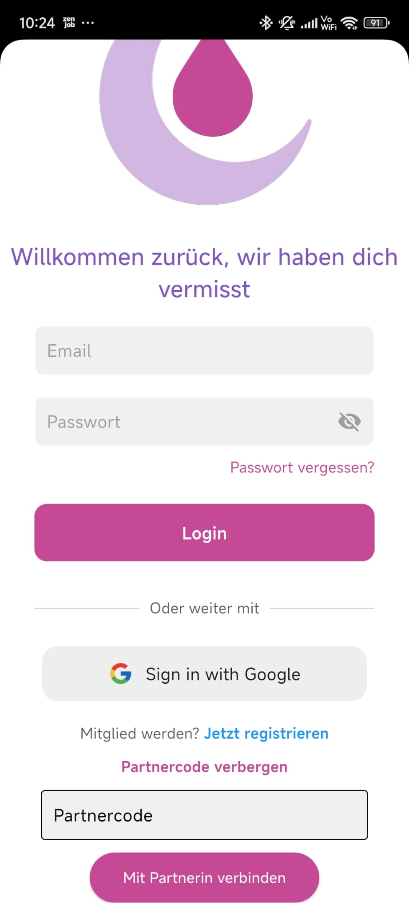
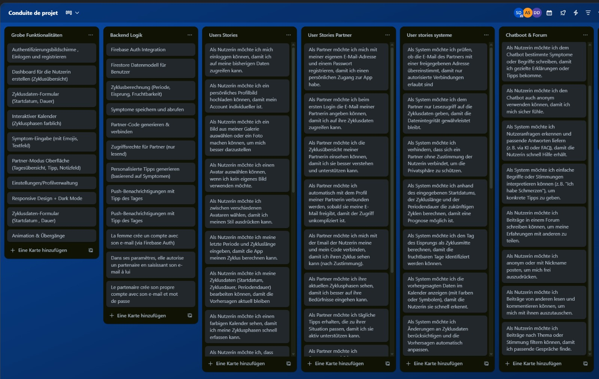

# MoonFlow – Zyklus- & Community-App

**MoonFlow** ist eine plattformübergreifende Flutter-App zur Menstruationszyklusverfolgung mit integriertem Community-Forum und Partner-Modus.  
Die App bietet Frauen eine diskrete, sichere und benutzerfreundliche Möglichkeit, ihren Zyklus zu dokumentieren, Symptome zu tracken und sich mit anderen auszutauschen.

---

## Features

- **Zykluskalender** – Übersichtliche Darstellung des Menstruationszyklus  
- **Symptom-Tracker** – Dokumentation von Symptomen, Stimmungen und Notizen  
- **Community-Forum** – Austausch von Erfahrungen und Tipps mit anderen Nutzerinnen  
- **Partner-Modus** – Teilen des Zyklus mit einer vertrauten Person (nur Leserechte)  
- **Sichere Authentifizierung** – Firebase Auth für Login/Registrierung  
- **Cloud-Speicherung** – Cloud Firestore für Daten- und Nachrichtenverwaltung  
- **Datenschutzfokus** – Diskretes Design, verschlüsselte Kommunikation, minimale Datenspeicherung  

---

## Technologien

- **Framework**: [Flutter](https://flutter.dev/) (Dart)  
- **Backend & Auth**: [Firebase Auth](https://firebase.google.com/docs/auth)  
- **Datenbank**: [Cloud Firestore](https://firebase.google.com/docs/firestore)  
- **Design**: Figma (Wireframes & UI-Design)  

---

## Use case diagramm



---

## Wireframes und Designentwicklung

- Die ersten Entwürfe der App wurden in **Figma** erstellt. Im Verlauf der Entwicklung wurden diese mehrfach überarbeitet und optimiert, um Benutzerfreundlichkeit, Design und Funktionalität zu verbessern.

  

---

## Finale UI

| SplashScreen | Login | register |
| --- | --- | --- |
| .jpg) | .jpg) | .jpg) |

| reset Password | Drawer Lightmode | Drawer Darkmode |
| --- | --- | --- |
| .jpg) | .jpg) | .jpg) |

| Profil | Language | Symptoms |
| --- | --- | --- |
| .jpg) | .jpg) | .jpg) |

| Zykluskalender | Symptom-Tracker | Community-Forum |
| --- | --- | --- |
| .jpg) | .jpg) | .jpg) |

| Forum-Commentpage | ChatBot | Partner page(create code) |
| --- | --- | --- |
| .jpg) | .jpg) | .jpg) |

| Login Partnerpage | Partner page |
| --- | --- |
|  | .jpg) |

---

## User Stories

Hier sind die Wichtigste User Stories:

1. **Zyklusverfolgung**  
   *Als Nutzerin möchte ich meinen Menstruationszyklus und Symptome protokollieren, um meine Gesundheit besser zu verstehen.*  
   - Kalenderübersicht  
   - Eingabe von Daten & Symptomen  
   - Erinnerungsfunktionen  

2. **Community-Austausch**  
   *Als Nutzerin möchte ich Erfahrungen mit anderen teilen und mich austauschen, um Unterstützung zu finden.*  
   - Posten von Beiträgen  
   - Kommentarfunktion  

3. **Partner-Modus**  
   *Als Nutzerin möchte ich meinen Zyklus mit einer vertrauten Person teilen können, ohne die Kontrolle über meine Daten zu verlieren.*  
   - Leserechte für Partner:innen  
   - Benachrichtigungen bei Updates  
  
  

---

## Installation & Setup

1. **Repository klonen**  

   ```bash
   git clone https://github.com/auriol00/EMA_projekt-Flutter-.git

2. **Abhängigkeiten installieren**  

   ```bash
   flutter pub get
   ```

3. **Firebase konfigurieren**  
   - Gehe zu [Firebase Console](https://console.firebase.google.com/)  
   - Neues Projekt anlegen  
   - Android- & iOS-App registrieren  
   - `google-services.json` (Android) bzw. `GoogleService-Info.plist` (iOS) hinzufügen  
   - Authentifizierung & Firestore aktivieren  

4. **App starten**  

   ```bash
   flutter run
   ```

---

## Beitragende(aus der Hochschule)

- **Auriol Sopning(me)**
- **Suzie Djouko**  
- **Davina Daouda**

---

## Wünsche für Erweiterungen

Während der Entwicklung standen uns nur begrenzte Ressourcen zur Verfügung, insbesondere durch die zeitliche Einschränkung während der Klausurphase.
Daher konnten einige geplante Funktionen noch nicht implementiert werden.
Zu den gewünschten Erweiterungen gehören unter anderem:

- **Benachrichtigungssystem**: Push-Benachrichtigungen für wichtige Zyklusereignisse und Community-Aktivitäten

- **Erweiterte Auswertungen**: Statistiken und Visualisierungen zur Zyklusanalyse

- **Mehrsprachigkeit**: Unterstützung für weitere Sprachen

- **Individuelle Anpassungen**: Personalisierbare Farben, Layouts und Erinnerungsoptionen

Diese Funktionen sind als zukünftige Verbesserungen geplant, um den Funktionsumfang und den Nutzen der App weiter zu steigern.

## Lizenz

Dieses Projekt wurde im Rahmen eines Hochschulkurses entwickelt und steht unter der MIT-Lizenz.  

---

## Beitragen

Pull Requests sind willkommen!  
Falls du größere Änderungen planst, eröffne bitte vorher ein Issue zur Diskussion.
